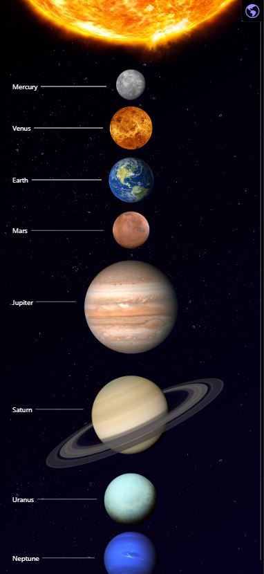
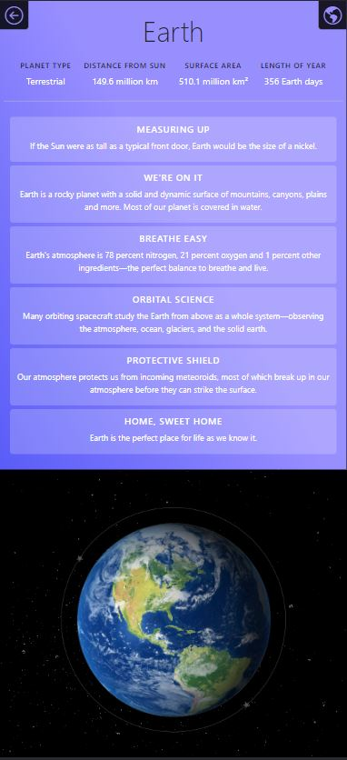

# Planets App

Front-end web application to learn more about the planets of the solar system! To view the app live click [HERE](https://solar-system-planets.web.app).

- SCSS syntax
- React front end framework
- Bootstrap CSS library, icons
- Planet facts source found at [NASA](https://solarsystem.nasa.gov/solar-system/our-solar-system/overview/).

## Screenshots

### 1. Desktop

### 2. Mobile

